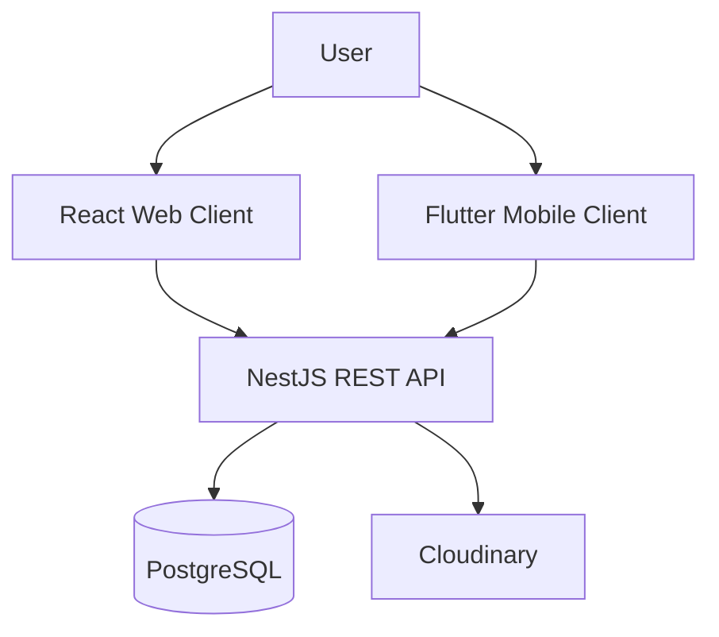

# 🌐 Social Connect

A modern, full-stack social media application built with a **NestJS** backend, **PostgreSQL** (Prisma ORM), **Cloudinary** media storage, and features both a **React** web application and a cross-platform **Flutter** mobile client.

---

## ✨ Features

- 🔐 **Authentication & Security**: Secure JWT authentication with user registration, login, and session persistence.
- 📰 **Dynamic Feed**: Real-time sorted feed with author avatars, like status, like count, comment count, and relative timestamps.
- 📸 **Post Creation**: Create posts with titles, captions, and photos uploaded directly to Cloudinary. Also supports post deletion and editing!
- 💬 **Interactive Comments & Likes**: Real-time like toggling and comments sheet with author deletion privileges.
- ✉️ **Direct Messaging**: 1-to-1 direct messaging between users with read status and unread badges.
- 👤 **Profiles & Customization**: User profile management with editable name, username, bio, and profile avatar upload.
- 👥 **Follow / Unfollow System**: Connect with other users, view follower/following lists, and explore other user profiles.
- 🔍 **User Search**: Instant user search by username or display name with debounce.
- 🔔 **Activity Notifications**: In-app notifications triggered by follows, likes, and comments with unread badges.
- 🌓 **Dark Mode / Light Mode**: Dynamic theme switcher for mobile and responsive design for web.

---

## 🏗️ Architecture & Tech Stack

### ⚙️ Backend
- **Framework**: [NestJS](https://nestjs.com/) (TypeScript)
- **Database**: PostgreSQL with [Prisma ORM](https://www.prisma.io/)
- **Media Storage**: [Cloudinary](https://cloudinary.com/) API
- **Containerization**: Docker & Docker Compose

### 💻 Web Client
- **Framework**: [React 19](https://react.dev/) + [Vite](https://vitejs.dev/)
- **Routing**: React Router
- **Networking**: Axios
- **Styling**: Vanilla CSS with responsive design

### 📱 Mobile Client
- **Framework**: [Flutter](https://flutter.dev/) (Dart)
- **State Management**: Stateful widgets & `ValueNotifier`
- **Networking**: `http` package with multipart upload support
- **Persistence**: `shared_preferences`

---

## 🧭 System Architecture



The web and mobile clients communicate with the NestJS backend. The backend uses PostgreSQL for application data and Cloudinary for uploaded media.

---

## 🗃️ Database / ER Diagram

> **Documentation TODO:** Add the ER diagram generated from the current Prisma schema. Keep entity names and relationships synchronized with the actual schema.

Suggested location: `docs/er-diagram.png`

---

## 🖼️ Screenshots

> **Documentation TODO:** Add current screenshots from the running web and Flutter applications. Use real application captures, not mockups.

Suggested folder structure:
- `docs/screenshots/web/`
- `docs/screenshots/mobile/`

| Client | Screenshots to add |
|---|---|
| Web | Login, feed, profile, messaging |
| Mobile | Login, feed, profile, messaging |

---

## 🌐 Demo

- **Live Web Demo:** Not published yet.
- **Demo Video:** Add a short walkthrough link when available.

---

## 🚀 Getting Started

### 1. Prerequisites
- Docker & Docker Compose
- Node.js (use a version supported by the project dependencies)
- Flutter SDK

### 2. Configure environment variables
Create the required environment file(s) using the project's example configuration, if present. Configure database, JWT, and Cloudinary settings as required by the backend.

> Never commit real passwords, API secrets, or private keys. Keep local environment files out of Git.

### 3. Start the database
```bash
docker-compose up -d
```

### 4. Start the backend
```bash
cd backend
npm install
npm run start:dev
```
Backend is expected at `http://localhost:3000` with the default local configuration.

### 5. Start the web client
Open a second terminal:
```bash
cd web
npm install
npm run dev
```
Vite usually serves the web client at `http://localhost:5173`.

### 6. Start the mobile client
Open another terminal:
```bash
cd mobile
flutter pub get
flutter run
```

For a physical phone, configure the API base URL to use the computer's reachable LAN IP rather than `localhost`.

---

## 🧪 Testing

Run the tests supported by each package before submitting changes:

- **Backend:** `cd backend && npm test`
- **Mobile:** `cd mobile && flutter test`
- **Web:** Check the web package scripts for the configured test command.

> Test coverage and CI status have not been documented yet. Add verified results here when available.

---

## 📡 API Overview (Key Endpoints)

| Method | Endpoint | Description |
|---|---|---|
| `POST` | `/auth/register` | Register new user account |
| `POST` | `/auth/login` | Log in and receive JWT token |
| `GET` | `/users/me` | Fetch authenticated user profile & stats |
| `GET` | `/users/search?q=:query` | Search users by keyword |
| `POST` | `/users/:id/follow` | Toggle follow/unfollow status |
| `GET` | `/posts?page=1&limit=10` | Get paginated feed posts |
| `POST` | `/posts` | Create new post |
| `PATCH` | `/posts/:id` | Update post content |
| `DELETE` | `/posts/:id` | Delete post |
| `POST` | `/likes/:postId` | Toggle like on post |
| `GET` | `/comments/:postId` | Get comments for a post |
| `GET` | `/messages/:userId` | Get chat history with user |
| `POST` | `/messages/:userId` | Send a direct message |
| `GET` | `/notifications` | Get user notifications |

---

## 🗺️ Roadmap

- [ ] Add verified web and mobile screenshots
- [ ] Add ER diagram based on the current database schema
- [ ] Publish a demo video or deployment link
- [ ] Document exact environment variables and migration steps
- [ ] Add verified test coverage and CI workflow details

---

## 📄 License

This project is licensed under the MIT License.
